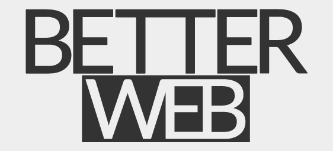

# Welcome to BetterWeb
This is an online community where you could share your thoughts and help improve the quality of deployed apps or websites.

### Developers
* Post your works and get feedback.
* You could add your project's github repository so people can contribute or inspect your code. Open source projects are encouraged.
* Help out other developers as well.
* Logged in developers can track their posts.

### Users / Website Owners
* Help make the web a better place just by sharing your thoughts!
* Hobbyist, business owner, blogger, writer, photographer, artist, etc. All kinds of website owners are welcome!

### Guest:
* Feel free to share your thoughts or make your own posts to get feedback.

## Tech stack:
* Express
* MongoDB
* React
* Node js
* Redux
* Socket.io
* AWS S3
* Local Passport

## Todo
### High priority:
* Image compression on upload
* More user information stored
* More user information displayed on userpage
* Comment karma system
* Show notification button on nav
* Tests

### Mid priority:
* User email verification
* User forgot password send reset password to email
* User verified badge
* Comment update shouldn't cause rerender on other sockets
* Edit comment
* ScrollToBottom on new comment if scrolled all the way down
* Notification on owned posts
* Notification on replied posts?
* Github, twitter and facebook passport
* Code cleanup
* New splash

### Low priority:
* Theme picker
* Posts pagination
* Socket for user update